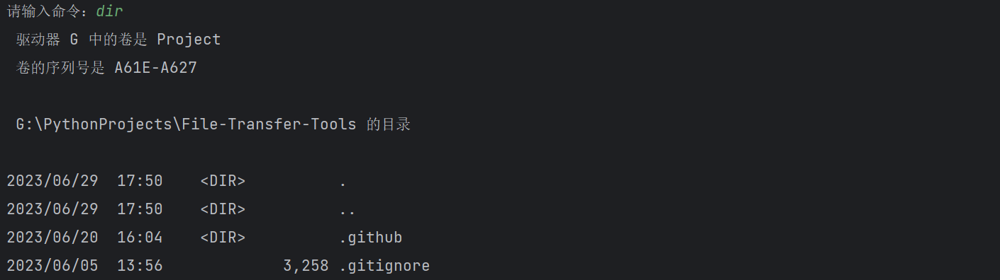
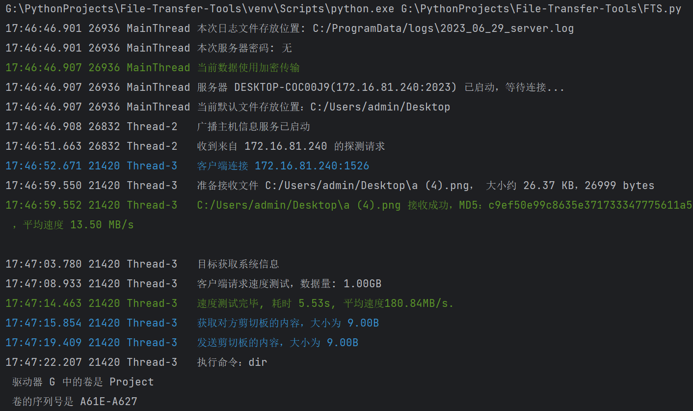

# Dateiübertragungs-Widget

## Einführung

`File Transfer Tools` enthält `FTS (File Transfer Server)` und `FTC (File Transfer Client)` zwei Komponenten, die **leicht**, **schnell**, **sicher** und mehr sind Leistungsstarkes geräteübergreifendes Dateiübertragungsskript.

### Funktion

1. Dateiübertragung

- Übertragen Sie einzelne Dateien oder ganze Ordner
- Sicherheitsgarantie: Verschlüsselte Übertragung (mittels Secure Sockets Layer Protocol) und Klartextübertragung können verwendet werden
- Korrektheitsgarantie: Überprüfen Sie die Konsistenz der Dateien anhand des Hash-Werts und beurteilen Sie, ob alle Dateien im Ordner korrekt übertragen werden
- Fortschrittsbalkenanzeige: Echtzeitanzeige des Dateiübertragungsfortschritts, der aktuellen Netzwerkgeschwindigkeit und der verbleibenden Übertragungszeit
- Drei Methoden zum Umbenennen der Datei mit demselben Namen, um doppelte Übertragungen zu vermeiden und um Übertragungen zu überschreiben

2. Befehlszeile, mit der Befehle problemlos aus der Ferne ausgeführt und Ergebnisse in Echtzeit zurückgegeben werden können, ähnlich wie bei ssh
3. Suchen Sie automatisch nach dem Diensthost oder geben Sie den Verbindungshost manuell an
4. Ordnervergleich, der Informationen wie Gleichheit und Unterschiede von Dateien in zwei Ordnern anzeigen kann
5. Zeigen Sie den Status und die Informationen des Client- und Serversystems an
6. Geben Sie Protokolle in Echtzeit an die Konsole und Dateien aus und können Sie komprimierte Protokolldateien automatisch organisieren
7. Testen Sie bequem die Netzwerkbandbreite zwischen Client und Server
8. Sie können ein Verbindungskennwort für den Server festlegen, um die Sicherheit zu erhöhen
9. Synchronisieren Sie bequem den Inhalt der Zwischenablage von Client und Server

### Merkmale

1. Starten, ausführen und schnell reagieren
2. Übernehmen Sie das Prinzip der minimalen Standardkonfiguration, das sofort verwendet werden kann, und Sie können die Konfiguration problemlos selbst ändern
2. Es kann in jeder Netzwerkumgebung wie LAN und öffentlichen Netzwerken verwendet werden, solange die beiden Hosts eine Verbindung zum Netzwerk herstellen können
3. Multithread-Übertragung, schnelle Übertragungsgeschwindigkeit, der eigentliche Test kann bis zu einer Bandbreite von 1000 Mbit/s laufen, aufgrund von Gerätebeschränkungen kein Test für höhere Bandbreite
4. Zur Laufzeit ist die Speichernutzung gering und der Lazy-Loading-Modus wird verwendet, um eine minimale Ressourcenbelegung sicherzustellen
5. Sofort öffnen, schließen und loslegen, nach dem Schließen des Programms bleibt kein Prozess mehr übrig
6. Derzeit kompatibel mit Windows- und Linux-Plattformen

### wie man wählt

1. Wenn Sie einen leistungsfähigeren Dateiübertragungsdienst wünschen, wählen Sie bitte einen FTP-Server oder -Client (z. B. `FileZilla`, `WinSCP` usw.)
2. Wenn Sie eine stabile Dateisynchronisierung und -freigabe wünschen, wird empfohlen, `Resilio Sync`, `Syncthing` usw. zu verwenden.
3. Wenn Sie Dateien nur gelegentlich übertragen/der Hintergrundspeicher und die Ressourcenbelegung der oben genannten Dienste nicht gefallen/Sie keinen so leistungsstarken Dienst benötigen/Funktionen anpassen möchten, wählen Sie bitte `Dateiübertragungstools`.

## Installieren und ausführen

`FTS` belegt standardmäßig die Ports 2023 und 2021 und FTC belegt standardmäßig Port 2022. Darunter wird Port 2023 als TCP-Abhörport von `FTS` verwendet, und 2021 und 2022 werden als UDP-Übertragungsschnittstellen zwischen dem Server und dem Client verwendet.
Sie können die detaillierten Konfigurationsinformationen überprüfen und die obige Konfiguration am Ende dieses Artikels ändern.

### Ausführbares Programm herunterladen

1. Klicken Sie rechts auf `Freigeben`.
2. Laden Sie `File Transfer Tools.zip` herunter
3. Entpacken Sie den Ordner und doppelklicken Sie zum Ausführen auf `FTC.exe` oder `FTS.exe`.
4. Oder führen Sie das Programm in einem Terminal aus, um Programmparameter wie `.\FTC.exe [-h] [-t thread] [-host host] [-p]` zu verwenden

### Mit dem Python-Interpreter ausführen

1. Klonen Sie den Quellcode in Ihren Projektspeicherort
2. Installieren Sie alle Abhängigkeiten mit `pip install -r require.txt`.
3. Führen Sie das Skript mit Ihrem Python-Interpreter aus

#### Verknüpfungsausführungsmethode

Am Beispiel von Windows können Sie die laufenden Befehle von FTS und FTC als Batchdateien schreiben und dann das Verzeichnis der Batchdatei zu Ihrer Umgebungsvariablen hinzufügen, sodass Sie einfach `FTS`, `FTC` eingeben können
Lassen Sie uns den standardmäßigen und einfachsten Befehl verwenden, um das Programm auszuführen.

Sie können beispielsweise den folgenden Befehl in die Datei `FTS.bat` schreiben

```Powershell
@echo aus
Das Verzeichnis Ihres Python-Interpreters`\Scripts\python.exe `Das Verzeichnis Ihres Projekts`\FTS.py %1 %2 %3 %4 %5 %6
```

Schreiben Sie den folgenden Befehl in die Datei `FTC.bat`.

```Powershell
@echo aus
Das Verzeichnis Ihres Python-Interpreters`\Scripts\python.exe `Das Verzeichnis Ihres Projekts`\FTC.py %1 %2 %3 %4 %5 %6
```

Fügen Sie dann den Batch-Ordner zu Ihren Umgebungsvariablen hinzu und geben Sie schließlich den folgenden Befehl in Ihr Terminal ein, um den Code schnell auszuführen

```Powershell
FTC.py [-h] [-t Thread] [-host Host] [-p Passwort] [--plaintext]
oder
FTS.py [-h] [-d Basisverzeichnis] ​​[-p Passwort] [--plaintext] [--avoid]
```

In der obigen Batchdatei stellt `%1~%9` die vom Programm übergebenen Parameter dar (`%0` stellt den aktuellen Pfad dar)
Beachten Sie, dass der Standardarbeitspfad des Terminals das Benutzerverzeichnis (~) ist. Wenn Sie die Konfigurationsdatei ändern müssen, ändern Sie sie bitte in diesem Verzeichnis.

## Verwendung

### FTC

FTC ist Auftraggeber für die Übermittlung von Dateien und Weisungen.

```
Verwendung: FTC.py [-h] [-t Thread] [-host Host] [-p Passwort] [--plaintext]

Dateiübertragungs-Client, der zum SENDEN von Dateien und Anweisungen verwendet wird.

optionale Argumente:
   -h, --help zeigt diese Hilfemeldung an und beendet den Vorgang
   -t Thread-Threads (Standard: 8)
   -host Host-Ziel-Hostname oder IP-Adresse
   -p Passwort, --password Passwort
                         Verwenden Sie ein Passwort, um eine Verbindung zum Host herzustellen.
   --plaintext Klartextübertragung verwenden (Standard: SSL verwenden)
```

#### Parameterbeschreibung

`-t`: Gibt die Anzahl der Threads an, der Standardwert ist die Anzahl der logischen Prozessoren.

`-host`: Geben Sie explizit den Server-Hostnamen (Hostname oder IP) und die Portnummer (optional) an. Wenn diese Option nicht verwendet wird, sucht der Client automatisch nach einem Server unter **dem gleichen Subnetz**

`-p`: Geben Sie explizit das Verbindungspasswort für den Server an (der Server hat standardmäßig kein Passwort).

`--plaintext`: Geben Sie explizit Klartextübertragungsdaten an, sodass der Server auch die Klartextübertragung verwenden muss.

#### Befehlsbeschreibung

Geben Sie nach einer normalen Verbindung den Befehl ein

1. Geben Sie den Pfad der Datei (des Ordners) ein und die Datei (der Ordner) wird gesendet
2. Geben Sie `sysinfo` ein, die Systeminformationen beider Parteien werden angezeigt
3. Geben Sie `speedtest n` ein und die Netzwerkgeschwindigkeit wird getestet, wobei n die Datenmenge in diesem Test in MB ist. Beachten Sie, dass in **Computernetzwerken** 1 GB = 1000 MB = 1000000 KB ist.
4. Geben Sie `compare local_dir dest_dir` ein, um den Unterschied zwischen den Dateien im lokalen Ordner und im Serverordner zu vergleichen.
5. Geben Sie `Clip Pull/Push` oder `Clip Get/Send` ein, um den Inhalt der Client- und Server-Zwischenablage zu synchronisieren
6. Wenn andere Inhalte eingegeben werden, werden diese als Anweisungen für die Ausführung durch den Server verwendet und das Ergebnis wird in Echtzeit zurückgegeben.

#### Screenshot ausführen

Im Folgenden finden Sie Screenshots, die auf demselben Host ausgeführt werden.

Programmstart


Dateien übertragen


Ausführungsbefehl: sysinfo


Führen Sie den Befehl aus: speedtest


Führen Sie den Befehl aus: vergleichen


Führen Sie den Befehl aus: Clip


Führen Sie Befehlszeilenbefehle aus



### FTS

`FTS` ist die Serverseite, die zum Empfangen und Speichern von Dateien sowie zum Ausführen der vom Client gesendeten Anweisungen verwendet wird.

```
Verwendung: FTS.py [-h] [-d Basisverzeichnis] ​​[-p Passwort] [--plaintext] [--avoid]

Dateiübertragungsserver, der zum EMPFANGEN von Dateien und zum AUSFÜHREN von Anweisungen verwendet wird.

optionale Argumente:
   -h, --help zeigt diese Hilfemeldung an und beendet den Vorgang
   -d Basisverzeichnis, --dest Basisverzeichnis
                         Dateispeicherort (Standard: C:\Benutzer\admin/Desktop)
   -p Passwort, --password Passwort
                         Legen Sie ein Passwort für den Host fest.
   --plaintext Klartextübertragung verwenden (Standard: SSL verwenden)
   --avoid Die Übertragung nicht fortsetzen, wenn der Dateiname wiederholt wird.
```

#### Parameterbeschreibung

`-d, --dest`: Geben Sie explizit den Dateiempfangsort an. Der Standardwert ist der Wert des Konfigurationselements `platform_default_path` (Windows-Plattform ist standardmäßig **Desktop**).

`-p, --password`: Legen Sie ein Passwort für den Server fest, um böswillige Verbindungen zu verhindern.

`--plaintext`: Geben Sie die Datenübertragung explizit im Klartext an und verwenden Sie standardmäßig die SSL-verschlüsselte Übertragung.

`--avoid`: Wenn diese Option aktiviert ist und bereits eine Datei mit demselben Namen im Verzeichnis vorhanden ist, gibt es zwei Fälle: Wenn die Größe der Datei auf der empfangenden Seite größer oder gleich der Größe der sendenden Seite ist, ** Blockieren** Sie die Übertragung der Datei, andernfalls empfangen und **überschreiben* *Diese Datei; diese Funktion wird hauptsächlich für die Neuübertragung verwendet, nachdem eine große Anzahl von Dateien gleichzeitig unterbrochen wurde, ähnlich der Neuübertragung an Haltepunkten, bitte **mit Vorsicht verwenden ** in anderen Fällen. Wenn die Option nicht aktiviert ist und der vorhandene Dateiname `a.txt` lautet, werden die übertragenen Dateien nacheinander nach `a (1).txt` und `a (2).txt` benannt.

#### Screenshot ausführen



## Aufbau

Die Konfigurationselemente befinden sich in der Konfigurationsdatei `config.txt`. Wenn die Konfigurationsdatei nicht vorhanden ist, erstellt das Programm automatisch die Standardkonfigurationsdatei

### Die Hauptkonfiguration des Hauptprogramms
`windows_default_path`: Der Standardspeicherort für den Dateiempfang auf der Windows-Plattform
`linux_default_path`: Der Standardspeicherort für den Dateiempfang unter der Linux-Plattform
`cert_dir`: Der Speicherort der Zertifikatsdatei

### Protokollbezogene Konfiguration
`windows_log_dir`: Der Standardspeicherort für Protokolldateien unter der Windows-Plattform
`linux_log_dir`: Der Standardspeicherort für Protokolldateien unter der Linux-Plattform
`log_file_archive_count`: Archivieren, wenn die Anzahl der Protokolldateien diese Größe überschreitet
`log_file_archive_size`: Archivieren, wenn die Gesamtgröße (Bytes) der Protokolldatei diese Größe überschreitet

### Portbezogener Inhalt zur Portkonfiguration
`server_port`: TCP-Abhörport des Servers
`server_signal_port`: UDP-Abhörport des Servers
`client_signal_port`: Client-UDP-Abhörport