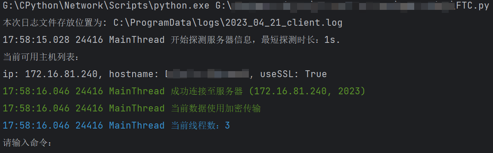
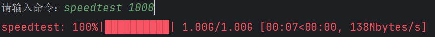
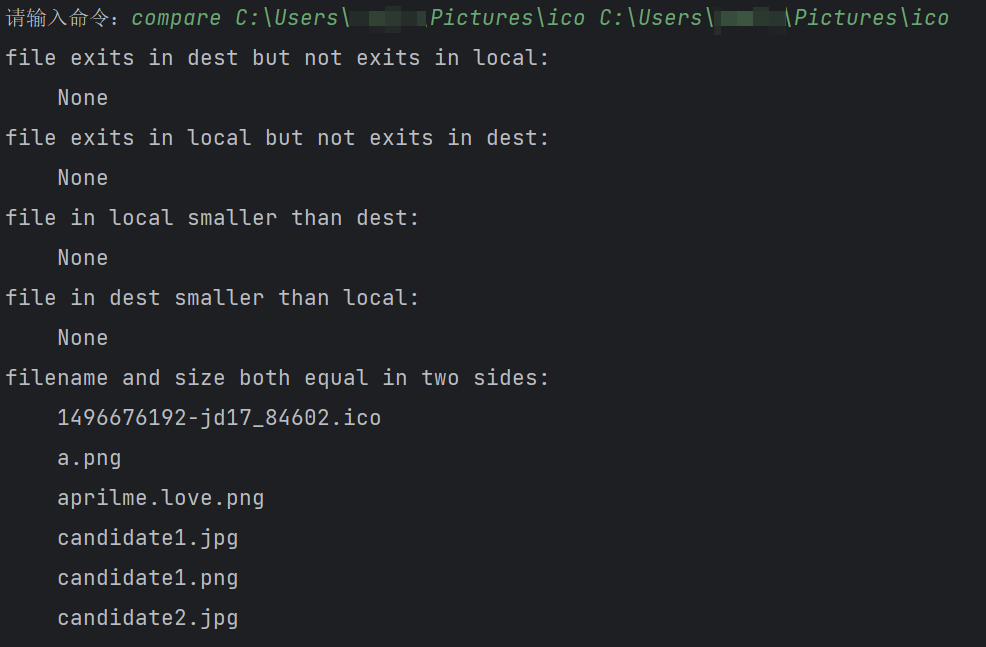
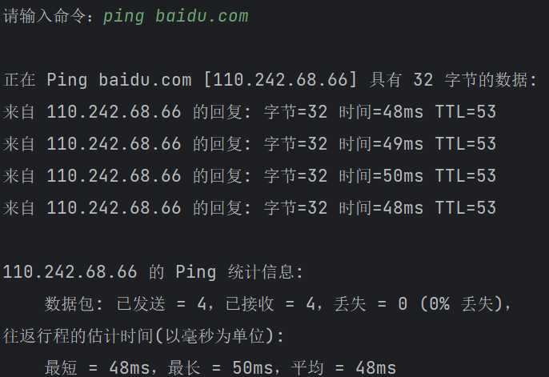
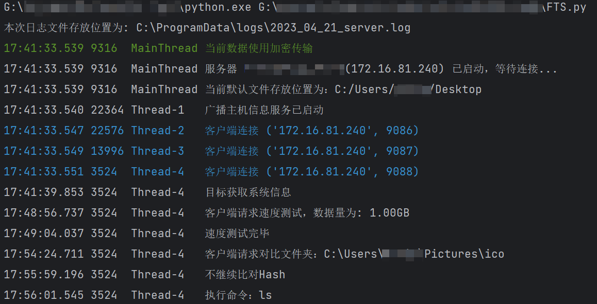

# Outil de transmission de fichiers

> Attention : cet article est traduit par machine, ce qui peut entraîner une mauvaise qualité ou des informations incorrectes, veuillez lire attentivement !

## Courte introduction

 `File Transfer Tools`  Inclure `FTS (File Transfer Server) ` ,, `FTC (File Transfer Client) ` Deux composantes, oui **Poids léger** Ainsi que **rapide** Ainsi que **Sécurité** Ainsi que **Multifonction** Script de transmission de fichiers cross -device.

### Fonction

1. transfert de fichier

  - Peut transmettre un seul fichier ou l'ensemble du dossier
  - Garantie de sécurité: transmission cryptée (en utilisant le protocole de couche de connexion de la concession), transmission explicite
  - Certaines garanties: grâce à la cohérence du fichier de vérification de la valeur de hachage, déterminez si tous les fichiers du dossier sont transmis correctement
  - Affichage de la barre de progression: progrès de la transmission du fichier d'affichage réel-temps, taux de réseau actuel, durée de transmission restante
  - Transmission nouvellement nommée, éviter la transmission répétée et couvrir la transmission du même nom

2. La ligne de commande peut facilement exécuter la commande à la télécommande et renvoyer le résultat en temps réel, similaire à SSH
3. Trouver automatiquement l'hôte de service, vous pouvez également spécifier manuellement l'hôte de connexion
4. La comparaison des dossiers peut afficher des informations des fichiers dans les deux dossiers, les mêmes, les différences, etc.
5. Vérifiez l'état et les informations du système et des informations du système client et serveur
6. Journaux de sortie du temps réel à la console et aux fichiers
7. Test de vitesse Internet

### Caractéristique

1. Vitesse rapide de démarrage, de course et de réponse
2. Il peut être utilisé dans n'importe quel environnement de réseau tel que le réseau local et le réseau public.
3. Transmission multi-thread, vitesse de transmission rapide, peut fonctionner plus de bande passante de 1000 Mbps dans la mesure réelle. En raison de la limite de l'équipement, aucune bande passante plus élevée n'est testée
4. L'occupation de la mémoire est petite pendant l'exécution
5. C'est-à-dire ouvrir et désactiver le processus ne restera pas le processus

### comment choisir

1. Si vous souhaitez un service de transmission de fichiers plus puissant, sélectionnez le serveur FTP et le client (tels que `FileZilla` Ainsi que `WinSCP` attendez)
2. Si vous souhaitez la synchronisation et le partage de fichiers stables, il est recommandé d'utiliser `Resilio Sync` Ainsi que `Syncthing` attendez
3. Si vous transmettez simplement des fichiers de temps en temps / Je n'aime pas la rétention d'arrière-plan des services ci-dessus, l'occupation des ressources / non plus puissant / Si vous souhaitez personnaliser votre propre fonction, veuillez choisir `File Transfer Tools` 

## Installation et fonctionnement

 `FTS` Occupy Port 2023.2021, la FTC occupe le port 2022. Parmi eux, le port 2023 est utilisé comme `FTS` Le port d'écoute TCP, 2021, 2022 en tant qu'interface de transmission UDP entre le serveur et le client. Vous pouvez vérifier les détails à la fin de cet article.

### Télécharger le programme exécutable

1. Cliquez à droite `Release` 
2. télécharger `File Transfer Tools.zip` 
3. Dossier unzip, double click `FTC.exe`  ou  `FTS.exe`  Juste courir
4. Ou exécutez le programme dans le terminal pour utiliser le paramètre du programme, par exemple `.\FTC.exe [-h] [-t thread] [-host host] [-p]` 

### Utilisez un interprète Python pour fonctionner

1. Clone le code source de votre projet
2. utiliser `pip install -r requirements.txt` Installez toutes les dépendances
3. Utilisez votre interprète Python pour exécuter le script

#### Méthode de pratique

Prenant l'exemple de Windows à titre d'exemple, vous pouvez écrire les commandes en cours d'exécution de FTS et FTCS en tant que fichiers de lots, puis ajouter le répertoire du fichier batch à votre variable d'environnement, afin que vous puissiez taper la ligne de commande simplement dans la ligne de commande `FTS` Ainsi que `FTC` Utilisons la commande par défaut et la plus simple pour exécuter le programme.

Par exemple, vous pouvez écrire la commande suivante dans le fichier `FTS.bat` milieu

```powershell
@echo off
 "The dir of your Python interpreter" \Scripts\python.exe  "The dir of your project" \FTS.py %1 %2 %3 %4 %5 %6
```

Écrivez la commande suivante dans le fichier `FTC.bat` milieu

```powershell
@echo off
 "The dir of your Python interpreter" \Scripts\python.exe  "The dir of your project" \FTC.py %1 %2 %3 %4 %5 %6
```

Ensuite, ajoutez le dossier Batch à votre variable d'environnement, et enfin tapez la commande suivante dans votre terminal pour exécuter le code rapidement

```powershell
FTC [-h] [-t thread] [-host host] [-p]
或
FTS [-h] [-d base_dir] [-p] [--avoid]
```

Dans le lot ci-dessus des documents de traitement, `%1~%9` Exprimer le paramètre du programme ( `%0` Représente le chemin actuel)


## usage

### FTC

FTC est un fichier Envoi, instruction envoyant fin, pour envoyer des fichiers et des instructions.

```
usage: FTC.py [-h] [-t thread] [-host host] [-p]

File Transfer Client, used to SEND files.

optional arguments:
  -h, --help       show this help message and exit
  -t thread        threading number (default: 3)
  -host host       destination hostname or ip address
  -p, --plaintext  Use plaintext transfer (default: use ssl)
```

#### Description du paramètre

 `-t` : Spécifiez le nombre de threads, la valeur par défaut est 3 threads.

 `-host` : Spécifiez explicitement l'hôte latéral de réception (en utilisant le nom d'hôte ou l'adresse IP). Lorsque cette option n'est pas utilisée, le client trouvera automatiquement **Le même sous-réseau** Le serveur

 `-p` : Coopérer `-host`  Utiliser, car les deux parties échangent automatiquement des informations, donc généralement ne doivent pas être spécifiées. Seulement lorsque les deux parties ne peuvent pas se connecter normalement, elle doit être apparemment spécifiée.

#### Instructions de commande

Après une connexion normale, entrez les instructions

1. Entrez le chemin du fichier (clip), puis exécutez le fichier d'envoi
2. entrer `sysinfo` , Affichera les informations système des deux parties
3. entrer `speedtest n` , Puis testez la vitesse du réseau. **Filet** Au milieu, 1 Go = 1000 Mo = 1000000 Ko.
4. entrer `compare local_dir dest_dir` Comparons la différence entre le dossier et le dossier du serveur.
5. Lors de la saisie d'autres contenus, effectuez-le comme une instruction et renvoyez les résultats en temps réel.

#### Exécuter une capture d'écran

Voici des captures d'écran fonctionnant sur le même hôte.










### FTS

 `FTS` Il s'agit de la fin de réception du fichier, du côté serveur, qui est utilisé pour recevoir et stocker des fichiers, et exécuter les instructions du client.

```
usage: FTS.py [-h] [-d base_dir] [-p] [--avoid]

File Transfer Server, used to RECEIVE files.

optional arguments:
  -h, --help            show this help message and exit
  -d base_dir, --dest base_dir
                        File storage location (default: C:\Users\admin\Desktop)
  -p, --plaintext       Use plaintext transfer (default: use ssl)
  --avoid               Do not continue the transfer when the file name is repeated.
```

#### Description du paramètre

 `-d, --dest` : Spécifiez la position de stockage du fichier, si elle n'est pas spécifiée, elle est stockée pour les utilisateurs actuels. **bureau** Alors, alors

 `-p` : Spécifiez la transmission explicite et utilisez la transmission de chiffrement SSL par défaut. Si vous n'avez pas de certificat de signature actuellement, veuillez spécifier la transmission explicite. **Afin d'assurer la sécurité, veuillez utiliser votre propre certificat de signature.** 

 `--avoid` : Au moment de l'ouverture, s'il y a déjà des fichiers du même nom dans le répertoire, il y a deux cas dans deux cas. **Prévenir** La transmission de ce fichier, sinon elle sera reçue et **Écraser** Ce fichier; cette fonction est principalement utilisée pour transmettre un grand nombre de fichiers après avoir été interrompu. **Utilisez prudemment** Lorsqu'il n'est pas ouvert, si le fichier est nommé `a.txt` Ensuite, le fichier transmis sera conformément à `a (1).txt` Ainsi que `a (2).txt` Nommé dans l'ordre.

#### Exécuter une capture d'écran



## Configuration

Élément de configuration `Utils.py` milieu

 `log_dir` : Emplacement du magasin de journaux </br>
 `cert_dir` : Magasin de certificats </br>
 `unit`  : Unité d'envoi de données </br>

 `server_port` : Port d'écoute du serveur TCP </b>
 `server_signal_port` : Port d'écoute UDP du serveur </br>
 `client_signal_port` : Port d'audition UDP client </br>

