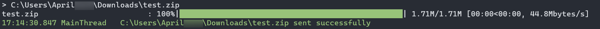
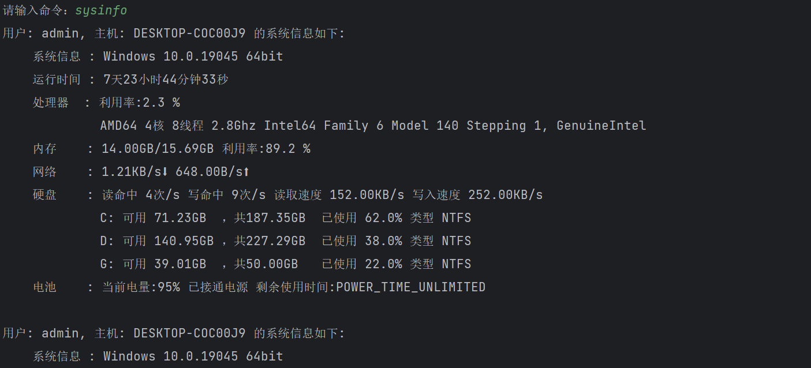
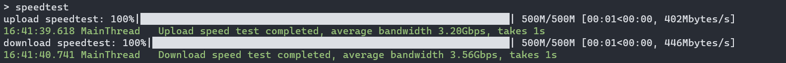
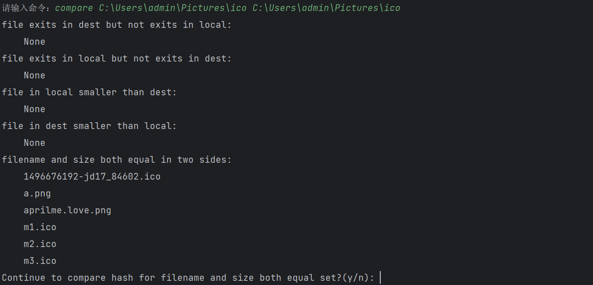

# File Transfer Tool

## Introduction

`File Transfer Tool` is a **lightweight**, **fast**, **safe**, and **multifunctional** cross-device file transfer tool.

### Function

1. File transfer

- Can transfer a single file or an entire folder, and supports resumed transfers
- Security guarantee: Generate an exclusive TLS/SSL security certificate for each session to maximize security
- Progress bar display: Real-time display of file transfer progress, current network speed, remaining transfer time and other information
- Specially optimized for transfer of small files (<1MB)

2. Provides a simple ssh-like function that can execute commands remotely and return results in real time
3. Automatically search for the service host, or manually specify the connection host
4. Folder comparison can display information such as similarities and differences between files in two folders.
5. Check system status and information of both parties
6. Output logs to the console and files in real time, and automatically organize and compress log files
7. Test the network bandwidth between both parties
8. Information can be transmitted at both ends to implement simple chat functions
9. Synchronize the clipboard contents at both ends
10. You can set a connection password for the server to enhance security

### Features

1. Fast startup, operation and response speed
2. Adopt the minimum default configuration principle, which can be used out of the box, or you can easily modify the configuration yourself.
2. It can be used in any network environment such as local area network or public network, as long as the two hosts can be connected to the network.
3. You can specify the number of threads and use multi-thread transmission
4. Receive information such as modification time and access time of retained files and folders
5. It can be turned on and off immediately, and no process will remain after closing the program.
6. Currently adapted to Windows and Linux platforms

### How to choose

1. If you want a more powerful file transfer service, please choose an FTP server or client (such as `FileZilla`, `WinSCP`, etc.)
2. If you want stable file synchronization and sharing, it is recommended to use `Resilio Sync`, `Syncthing`, etc.
3. If you only transfer files occasionally/don’t like the background storage and resource usage of the above services/don’t need such powerful services/want to customize the functions yourself, please choose `File Transfer Tools`

## Install and run

### Method 1: Download the executable program

1. Click `Release` on the right
2. Download the compressed package
3. Unzip the folder and double-click `FTT.exe` to run it with the default configuration.
4. Or run the program in the terminal to use program parameters, such as `.\FTT.exe [-h] [-t thread] [-host host] [-d destination] [-p password] `

### Method 2: Run using Python interpreter

1. Clone the source code to your project location
2. Use `pip install -r requirements.txt` to install all dependencies
3. Execute the script using your python interpreter

## Usage

FTT can provide services to two parties at the same time, and both parties can transfer files to each other and execute instructions.

### Things to note when establishing a connection
1. If no password is set, FTT will automatically search for the host and connect to it by default after opening it. It is recommended to use this method only in a simple LAN environment.
2. If you are in a complex network environment or need to connect to the public network, one party needs to set a password, and the other party needs to specify the host name or IP address and password to connect.

#### Parameter Description

```
usage: FTT.py [-h] [-t thread] [-host host] [-p password] [-d base_dir]

File Transfer Tool, used to transfer files and execute commands.

options:
   -h, --help show this help message and exit
   -t thread Threads (default: cpu count)
   -host host Destination hostname or ip address
   -p password, --password password
                         Set a password for the host or Use a password to connect host.
   -d base_dir, --dest base_dir
                         File save location (default: ~\Desktop)
```

`-t`: Specify the number of threads, the default is the number of processors.

`-p`: Explicitly set the host password or specify the connection password (no password by default). When this option is not used, servers under the same subnet are automatically searched.
    
`-host`: Specify the host name of the other party (hostname or ip can be used) and port number (optional), which must be used with `-p`.

`-d`: Explicitly specify the file receiving location, the default is **desktop** on Windows platform.


#### Command description

After the connection is successful, enter the command

1. Enter the file (folder) path, and the file (folder) will be sent.
2. Enter `sysinfo`, the system information of both parties will be displayed.
3. Enter `speedtest n`, and the network speed will be tested, where n is the amount of data for this test, in MB. Note that in **Computer Network**, 1 GB = 1000 MB = 1000000 KB.
4. Enter `compare local_dir dest_dir` to compare the differences in files in the local folder and the server folder.
5. Enter `say` to send a message to the other party, which can be used as a simple chat server
6. Enter `setbase` to change the file receiving location
7. Enter `get clipboard` or `send clipboard` to synchronize the clipboard contents of the client and server
8. When inputting other content, it will be used as a command to be executed by the server, and the results will be returned in real time.

#### Running screenshot

The following are screenshots running on the same host.

Program start


Transfer files



Execute command: sysinfo



Execute command: speedtest



Execute command: compare



Execute command: clip


Execute command: say


Execute command: setbase


Execute command line command


## Configuration

The configuration items are in the configuration file `config`. When the configuration file does not exist, the program will use the default configuration.

### Main program main configuration

`windows_default_path`: The default file receiving location under Windows platform

`linux_default_path`: The default file receiving location under Linux platform

### Log log related configuration

`windows_log_dir`: The default log file storage location under Windows platform

`linux_log_dir`: The default log file storage location under the Linux platform

`log_file_archive_count`: archive when the number of log files exceeds this size

`log_file_archive_size`: Archive when the total size (bytes) of the log file exceeds this size

### Port configuration port related content

`server_port`: Server TCP listening port

`signal_port`: UDP listening port