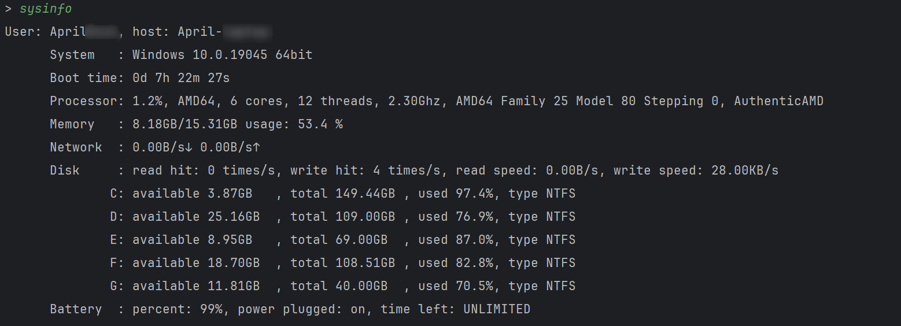

# Widget de transfert de fichiers

## Introduction

`File Transfer Tools` contient `FTS (File Transfer Server)` et `FTC (File Transfer Client)` deux composants, qui sont **légers**, **rapides**, **sûrs**, et plus puissant script de transfert de fichiers multi-appareils.

### Fonction

1. Transfert de fichiers

- Transférer des fichiers individuels ou des dossiers entiers
- Garantie de sécurité : la transmission cryptée (à l'aide du protocole Secure Sockets Layer) et la transmission en texte clair peuvent être utilisées
- Garantie d'exactitude : vérifiez la cohérence des fichiers via la valeur de hachage et jugez si tous les fichiers du dossier sont correctement transmis.
- Affichage de la barre de progression : affichage en temps réel de la progression du transfert de fichiers, de la vitesse actuelle du réseau et du temps de transfert restant
- Trois méthodes pour renommer le fichier avec le même nom, éviter le transfert en double et écraser le transfert

2. Ligne de commande, qui peut facilement exécuter des commandes à distance et renvoyer des résultats en temps réel, similaire à ssh
3. Trouver automatiquement l'hôte de service ou spécifier manuellement l'hôte de connexion
4. Comparaison de dossiers, qui peut afficher des informations telles que les mêmes et les différences de fichiers dans deux dossiers
5. Afficher l'état et les informations du système client et serveur
6. Exportez les journaux vers la console et les fichiers en temps réel, et pouvez organiser automatiquement les fichiers journaux compressés
7. Testez facilement la bande passante du réseau entre le client et le serveur
8. Vous pouvez définir un mot de passe de connexion pour le serveur afin d'améliorer la sécurité
9. Synchronisez facilement le contenu du presse-papiers du client et du serveur

### Caractéristiques

1. Commencez, courez et répondez rapidement
2. Adoptez le principe de configuration par défaut minimum, qui peut être utilisé hors de la boîte, et vous pouvez facilement modifier la configuration par vous-même
2. Il peut être utilisé dans n'importe quel environnement réseau tel que LAN et réseau public, tant que les deux hôtes peuvent se connecter au réseau
3. Transmission multithread, vitesse de transmission rapide, le test réel peut fonctionner jusqu'à 1000 Mbps de bande passante, en raison des limitations de l'équipement, pas de test pour une bande passante plus élevée
4. L'utilisation de la mémoire est faible lors de l'exécution et le mode de chargement paresseux est adopté pour garantir une occupation minimale des ressources
5. Ouvrir, fermer et partir instantanément, aucun processus ne restera après la fermeture du programme
6. Actuellement compatible avec les plates-formes Windows et Linux

### comment choisir

1. Si vous souhaitez un service de transfert de fichiers plus puissant, veuillez choisir un serveur FTP, un client (tel que `FileZilla`, `WinSCP`, etc.)
2. Si vous souhaitez une synchronisation et un partage de fichiers stables, il est recommandé d'utiliser `Resilio Sync`, `Syncthing`, etc.
3. Si vous ne transférez des fichiers qu'occasionnellement/n'aimez pas le stockage en arrière-plan et l'occupation des ressources des services ci-dessus/n'avez pas besoin d'un service aussi puissant/souhaitez personnaliser les fonctions, veuillez choisir "Outils de transfert de fichiers"

## Installer et exécuter

`FTS` occupe les ports 2023 et 2021 par défaut, et FTC occupe le port 2022 par défaut. Parmi eux, le port 2023 est utilisé comme port d'écoute TCP de "FTS", et 2021 et 2022 sont utilisés comme interfaces de transmission UDP entre le serveur et le client.
Vous pouvez vérifier les informations de configuration détaillées et modifier la configuration ci-dessus à la fin de cet article.

### Télécharger le programme exécutable

1. Cliquez sur "Libérer" à droite
2. Téléchargez `Outils de transfert de fichiers.zip`
3. Décompressez le dossier, double-cliquez sur `FTC.exe` ou `FTS.exe` pour exécuter
4. Ou exécutez le programme dans un terminal pour utiliser les paramètres du programme, tels que `.\FTC.exe [-h] [-t thread] [-host host] [-p]`

### Exécuter avec l'interpréteur Python

1. Clonez le code source dans l'emplacement de votre projet
2. Installez toutes les dépendances en utilisant `pip install -r requirements.txt`
3. Exécutez le script à l'aide de votre interpréteur Python

#### méthode d'exécution du raccourci

En prenant Windows comme exemple, vous pouvez écrire les commandes en cours d'exécution de FTS et FTC sous forme de fichiers batch, puis ajouter le répertoire du fichier batch à votre variable d'environnement, de sorte que vous puissiez simplement taper `FTS `, `FTC`
Utilisons la commande par défaut et la plus simple pour exécuter le programme.

Par exemple, vous pouvez écrire la commande suivante dans le fichier `FTS.bat`

```powershell
@Écho off
"Le répertoire de votre interpréteur Python"\Scripts\python.exe "Le répertoire de votre projet"\FTS.py %1 %2 %3 %4 %5 %6
```

Écrivez la commande suivante dans le fichier `FTC.bat`

```powershell
@Écho off
"Le répertoire de votre interpréteur Python"\Scripts\python.exe "Le répertoire de votre projet"\FTC.py %1 %2 %3 %4 %5 %6
```

Ensuite, ajoutez le dossier batch à vos variables d'environnement, et enfin tapez la commande suivante dans votre terminal pour exécuter rapidement le code

```powershell
FTC.py [-h] [-t thread] [-host hôte] [-p mot de passe] [--plaintext]
ou
FTS.py [-h] [-d base_dir] [-p mot de passe] [--plaintext] [--avoid]
```

Dans le fichier batch ci-dessus, `%1~%9` représente les paramètres transmis par le programme (`%0` représente le chemin actuel)
Notez que le chemin de travail par défaut du terminal est le répertoire utilisateur (~), si vous avez besoin de modifier le fichier de configuration, veuillez le modifier dans ce répertoire.

## Utilisation

### FTC

FTC est le client pour l'envoi de fichiers et d'instructions.

```
utilisation : FTC.py [-h] [-t thread] [-host hôte] [-p mot de passe] [--plaintext]

Client de transfert de fichiers, utilisé pour ENVOYER des fichiers et des instructions.

arguments facultatifs :
   -h, --help affiche ce message d'aide et quitte
   -t thread threads (par défaut : 8)
   -host nom d'hôte ou adresse IP de destination de l'hôte
   -p mot de passe, --password mot de passe
                         Utilisez un mot de passe pour connecter l'hôte.
   --plaintext Utiliser le transfert en clair (par défaut : utiliser ssl)
```

#### Paramètre Description

`-t` : Spécifie le nombre de threads, la valeur par défaut est le nombre de processeurs logiques.

`-host` : spécifiez explicitement le nom d'hôte du serveur (nom d'hôte ou adresse IP) et le numéro de port (facultatif). Lorsque cette option n'est pas utilisée, le client recherchera automatiquement un serveur sous **même sous-réseau**

`-p` : Spécifiez explicitement le mot de passe de connexion pour le serveur (le serveur n'a pas de mot de passe par défaut).

`--plaintext` : spécifiez explicitement les données de transmission en clair, ce qui oblige le serveur à utiliser également la transmission en clair.

#### Description de la commande

Après une connexion normale, entrez la commande

1. Entrez le chemin du fichier (dossier) et le fichier (dossier) sera envoyé
2. Entrez `sysinfo`, les informations système des deux parties seront affichées
3. Entrez `speedtest n`, et la vitesse du réseau sera testée, où n est la quantité de données dans ce test, en Mo. Notez que dans **Réseau informatique**, 1 Go = 1 000 Mo = 1 000 000 Ko.
4. Entrez `compare local_dir dest_dir` pour comparer la différence entre les fichiers du dossier local et le dossier du serveur.
5. Entrez `clip pull/push` ou `clip get/send` pour synchroniser le contenu du presse-papiers client et serveur
6. Lorsqu'un autre contenu est saisi, il est utilisé comme une instruction à exécuter par le serveur et le résultat est renvoyé en temps réel.

#### Exécuter la capture d'écran

Voici des captures d'écran exécutées sur le même hôte.

démarrage du programme


transférer des fichiers


Commande d'exécution : sysinfo



Exécutez la commande : speedtest


Exécutez la commande : comparer


Exécutez la commande : clip


Exécuter des commandes de ligne de commande


### FTS

`FTS` est le côté serveur, utilisé pour recevoir et stocker des fichiers et exécuter les instructions envoyées par le client.

```
utilisation : FTS.py [-h] [-d base_dir] [-p mot de passe] [--plaintext] [--avoid]

File Transfer Server, utilisé pour RECEVOIR des fichiers et EXECUTER des instructions.

arguments facultatifs :
   -h, --help affiche ce message d'aide et quitte
   -d rép_base, --dest rép_base
                         Emplacement de stockage des fichiers (par défaut : C:\Users\admin/Desktop)
   -p mot de passe, --password mot de passe
                         Définissez un mot de passe pour l'hôte.
   --plaintext Utiliser le transfert en clair (par défaut : utiliser ssl)
   --avoid Ne continue pas le transfert lorsque le nom du fichier est répété.
```

#### Paramètre Description

`-d, --dest` : spécifiez explicitement l'emplacement de réception du fichier, la valeur par défaut est la valeur de l'élément de configuration "platform_default_path" (la plate-forme Windows par défaut est **desktop**).

`-p, --password` : définissez un mot de passe pour le serveur afin d'empêcher les connexions malveillantes.

`--plaintext` : spécifiez explicitement la transmission de données en texte brut et utilisez la transmission chiffrée ssl par défaut.

`--avoid` : lorsqu'il est activé, s'il existe déjà un fichier portant le même nom dans le répertoire, il y a deux cas. Si la taille du fichier à l'extrémité de réception est supérieure ou égale à l'extrémité d'envoi, ** bloquer** la transmission du fichier, sinon recevoir et **écraser* *Ce fichier ; cette fonction est principalement utilisée pour la retransmission après qu'un grand nombre de fichiers sont interrompus en même temps, similaire à la retransmission de point d'arrêt, veuillez **utiliser avec prudence ** dans d'autres cas. Lorsqu'il n'est pas activé, si le nom de fichier existant est `a.txt`, les fichiers transférés seront nommés selon `a (1).txt`, `a (2).txt` dans l'ordre.

#### Exécutez la capture d'écran


## configuration

Les éléments de configuration sont dans le fichier de configuration `config.txt`, lorsque le fichier de configuration n'existe pas, le programme créera automatiquement le fichier de configuration par défaut

### La configuration principale du programme principal
`windows_default_path` : L'emplacement de réception du fichier par défaut sous la plate-forme Windows

`linux_default_path` : l'emplacement de réception du fichier par défaut sous la plate-forme Linux

`cert_dir` : l'emplacement de stockage du fichier de certificat

### Configuration liée au journal
`windows_log_dir` : L'emplacement de stockage du fichier journal par défaut sous la plate-forme Windows

`linux_log_dir` : L'emplacement de stockage du fichier journal par défaut sous la plate-forme Linux

`log_file_archive_count` : archive lorsque le nombre de fichiers journaux dépasse cette taille

`log_file_archive_size` : archive lorsque la taille totale (octets) du fichier journal dépasse cette taille

### Contenu relatif au port de configuration de port
`server_port` : port d'écoute TCP du serveur

`server_signal_port` : port d'écoute UDP du serveur

`client_signal_port` : port d'écoute UDP du client