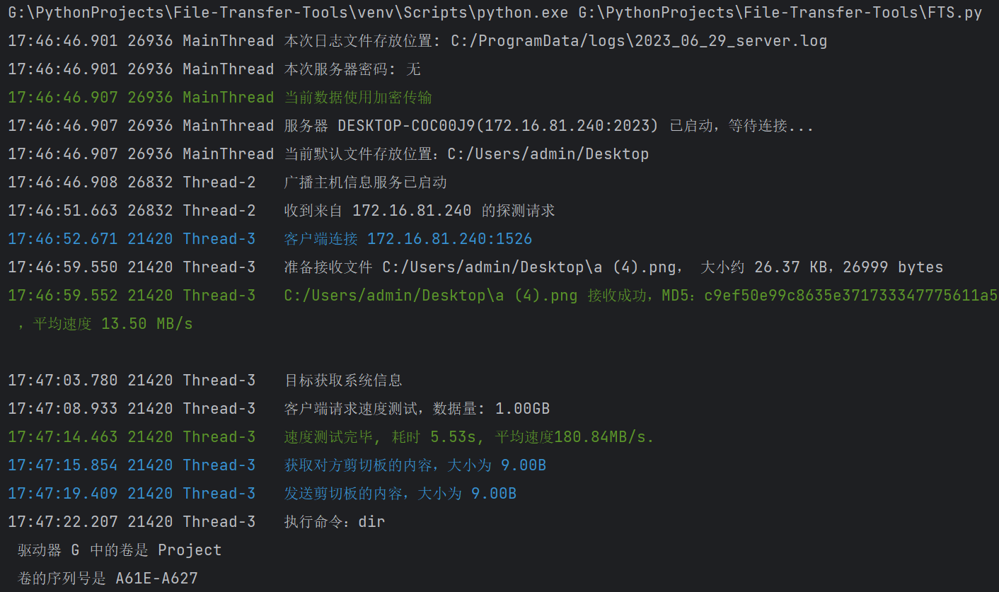

# 檔案傳輸小工具

## 簡介

`File Transfer Tools` 包含`FTS (File Transfer Server) `，`FTC (File Transfer Client) `兩個元件，是**輕量**、**快速**、**安全**、**多功能**的跨裝置檔案傳輸腳本。

### 功能

1. 文件傳輸

- 可傳輸單一檔案或整個資料夾
- 安全性保障：可使用加密傳輸（使用安全通訊端層協定）、也可以明文傳輸
- 正確性保障：透過Hash值校驗檔案的一致性，判斷資料夾內所有檔案是否都正確傳輸
- 進度條顯示：即時顯示檔案傳輸進度、目前網路速率、剩餘傳輸時長
- 同名檔案新命名傳輸、避免重複傳輸、覆蓋傳輸三種方式

2. 命令列，可以便捷地在遠端執行命令並即時返回結果，類似ssh
3. 自動尋找服務主機，也可手動指定連接主機
4. 資料夾比較，可顯示兩個資料夾中的檔案的相同、差異等訊息
5. 查看客戶端與服務端系統狀態、訊息
6. 即時輸出日誌到控制台和文件中，並且可以自動整理壓縮日誌文件
7. 便捷測試客戶端與伺服器之間的網路頻寬
8. 可以為伺服器設定連線密碼，增強安全性
9. 便捷同步客戶端與伺服器的剪切板內容

### 特點

1. 啟動、運轉、反應速度快
2. 採用最小預設配置原則，即開即用，也可以方便地自行修改配置
2. 可在區域網路、公網等任一網路環境使用，只要兩台主機可以進行網路連線即可
3. 多執行緒傳輸，傳輸速度快，實測可以跑滿1000Mbps頻寬，由於設備限制，沒有測試更高頻寬
4. 執行時期記憶體佔用小，採用懶載入模式，確保資源的最小佔用
5. 即用即開，即關即走，關閉程式後不會殘留進程
6. 目前適配Windows和Linux平台

### 如何選擇

1. 如果你想要功能更強大的檔案傳輸服務，請選擇FTP伺服器、客戶端（如`FileZilla`、`WinSCP`等）
2. 如果你想要穩定的檔案同步與分享，推薦使用`Resilio Sync`、`Syncthing`等
3. 如果你只是偶爾傳輸檔案/不喜歡上述服務的後台存留、資源佔用/不需要那麼強大的服務/想要自己定制功能那請選擇`File Transfer Tools`

## 安裝與運行

`FTS`預設佔用2023，2021端口，FTC預設佔用2022端口。 其中2023個連接埠作為`FTS`的TCP偵聽端口，2021、2022作為伺服器和客戶端之間UDP傳輸介面。
你可以在本文末尾查看詳細配置資訊並修改上述配置。

### 下載可執行程式

1. 點選右側`Release`
2. 下載`File Transfer Tools.zip`
3. 解壓縮資料夾，雙擊`FTC.exe` 或 `FTS.exe` 即可執行
4. 或在終端機中執行程式以使用程式參數，例如`.\FTC.exe [-h] [-t thread] [-host host] [-p]`

### 使用Python解釋器運行

1. 將原始碼複製到你的專案位置
2. 使用`pip install -r requirements.txt`安裝所有依賴項
3. 使用你的python解釋器執行腳本

#### 快速執行方法

以Windows為例，你可以將FTS、FTC的運行命令分別編寫為批次文件，然後將批次文件的目錄添加到你的環境變數中，這樣你就可以透過簡單的在命令列中鍵入`FTS `、`FTC`
來使用預設的、最簡單的命令來運行程式了。

例如，你可以將下面指令寫入檔案`FTS.bat`中

```powershell
@echo off
"The dir of your Python interpreter"\Scripts\python.exe "The dir of your project"\FTS.py %1 %2 %3 %4 %5 %6
```

將下面指令寫入檔案`FTC.bat`中

```powershell
@echo off
"The dir of your Python interpreter"\Scripts\python.exe "The dir of your project"\FTC.py %1 %2 %3 %4 %5 %6
```

然後，將批次資料夾加入你的環境變數中，最後在你的終端機中鍵入以下命令就可以快速執行程式碼了

```powershell
FTC.py [-h] [-t thread] [-host host] [-p password] [--plaintext]
或
FTS.py [-h] [-d base_dir] [-p password] [--plaintext] [--avoid]
```

在上述批次檔中，`%1~%9`表示程式傳入的參數（`%0`表示目前路徑）
注意，終端的預設工作路徑為使用者目錄(~)，如需修改設定文件，請到該目錄下修改。

## 用法

### FTC

FTC是客戶端，用於傳送檔案和指令。

```
usage: FTC.py [-h] [-t thread] [-host host] [-p password] [--plaintext]

File Transfer Client, used to SEND files and instructions.

optional arguments:
  -h, --help            show this help message and exit
  -t thread             threads (default: 8)
  -host host            destination hostname or ip address
  -p password, --password password
                        Use a password to connect host.
  --plaintext           Use plaintext transfer (default: use ssl)
```

#### 參數說明

`-t`: 指定執行緒數，預設為邏輯處理器數量。

`-host`: 明確指定伺服器主機名稱(可使用hostname或ip)及連接埠號碼(可選)，不使用此選項時，用戶端會自動尋找**相同子網路**下的伺服器

`-p`: 明確指定伺服器的連線密碼（預設伺服器沒有密碼）。

`--plaintext`: 明確指定明文傳輸數據，需要伺服器也使用明文傳輸。

#### 指令說明

正常連線後，輸入指令

1. 輸入檔案（夾）路徑，則會傳送檔案（夾）
2. 輸入`sysinfo`，則會顯示雙方的系統訊息
3. 輸入`speedtest n`，則會測試網速，其中n為本次測試的資料量，單位MB。 注意，在**電腦網路**中，1 GB = 1000 MB = 1000000 KB.
4. 輸入`compare local_dir dest_dir`來比較本機資料夾和伺服器資料夾中檔案的差異。
5. 輸入`get clipboard` 或 `send clipboard`來同步客戶端和伺服器的剪切板內容
6. 輸入其他內容時作為指令讓伺服器執行，並且即時回傳結果。

#### 運行截圖

以下均為在同一台主機上執行的截圖。

程式啟動


傳輸檔案


執行指令：sysinfo


執行指令：speedtest


執行命令：compare


執行命令：clip


執行命令列命令


### FTS

`FTS`是伺服器端，用於接收並儲存文件，執行客戶端發送的指令。
接收單一檔案時，若檔案已存在，則使用新的名稱接收；接收資料夾中的檔案時，若檔案已存在，則不會接收並變更原有檔案。

```
usage: FTS.py [-h] [-d base_dir] [-p password] [--plaintext] [--avoid]

File Transfer Server, used to RECEIVE files and EXECUTE instructions.

optional arguments:
  -h, --help            show this help message and exit
  -d base_dir, --dest base_dir
                        File storage location (default: C:\Users\admin/Desktop)
  -p password, --password password
                        Set a password for the host.
  --plaintext           Use plaintext transfer (default: use ssl)
  --avoid               Do not continue the transfer when the file name is repeated.
```

#### 參數說明

`-d, --dest`: 明確指定檔案接收位置，預設為設定項"平台_default_path"的值(Windows平台預設為**桌面**)。

`-p, --password`: 為伺服器設定一個密碼，防止惡意連線。

`--plaintext`: 明確指定資料明文傳輸，預設使用ssl加密傳輸。

#### 運行截圖



## 配置

配置項在設定檔`config.txt`中，當設定檔不存在時，程式會自動建立預設的設定文件

### Main 程式的主要配置
`windows_default_path`: Windows平台下預設的檔案接收位置

`linux_default_path`: Linux平台下預設的檔案接收位置

`cert_dir`: 憑證檔案的存放位置

### Log 日誌相關配置
`windows_log_dir`: Windows平台下預設的日誌檔案存放位置

`linux_log_dir`: Linux平台下預設的日誌檔案存放位置

`log_file_archive_count`: 當日誌檔案數超過該大小時歸檔

`log_file_archive_size`: 當日誌檔案的總大小(位元組)超過該大小時歸檔

### Port 設定連接埠相關內容
`server_port`：伺服器 TCP 偵聽連接埠

`server_signal_port`：伺服器 UDP 偵聽連接埠

`client_signal_port`：客戶端 UDP 偵聽連接埠