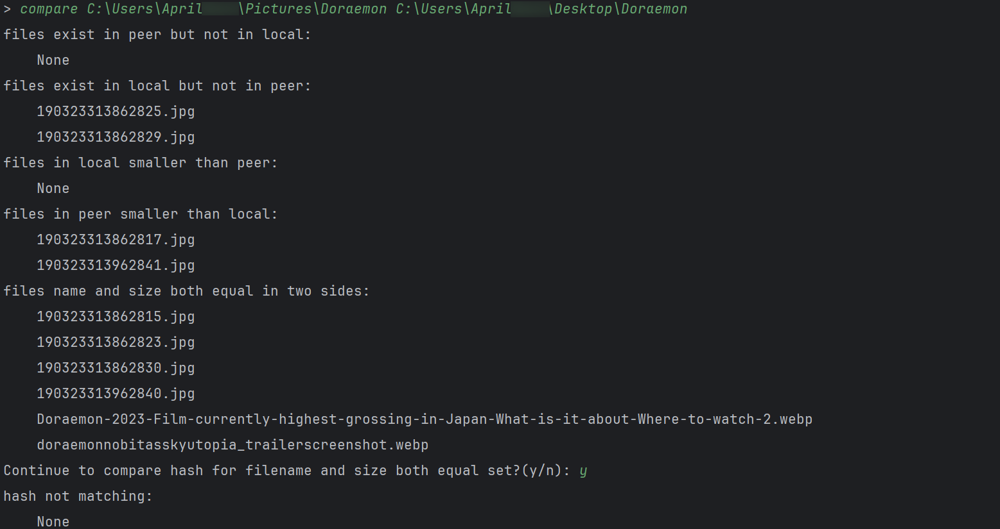

# 文件傳輸小工具

## 簡介

`File Transfer Tools` 包含`FTS (File Transfer Server) `，`FTC (File Transfer Client) `兩個組件，是**輕量**、**快速**、**安全**、**多功能**的跨設備文件傳輸腳本。

### 功能

1. 文件傳輸

- 可傳輸單個文件或者整個文件夾
- 安全性保障：可以使用加密傳輸（使用安全套接字層協議）、也可以明文傳輸
- 正確性保障：通過Hash值校驗文件的一致性，判斷文件夾內所有文件是否都正確傳輸
- 進度條顯示：實時顯示文件傳輸進度、當前網絡速率、剩餘傳輸時長
- 同名文件新命名傳輸、避免重複傳輸、覆蓋傳輸三種方式

2. 命令行，可以便捷地在遠端執行命令並實時返回結果，類似ssh
3. 自動尋找服務主機，也可手動指定連接主機
4. 文件夾比較，可顯示兩個文件夾中的文件的相同、差異等信息
5. 查看客戶端與服務端系統狀態、信息
6. 實時輸出日誌到控制台和文件中，並且可以自動整理壓縮日誌文件
7. 便捷測試客戶端與服務器之間的網絡帶寬
8. 可以為服務器設置連接密碼，增強安全性
9. 便捷同步客戶端和服務器的剪切板內容

### 特點

1. 啟動、運行、響應速度快
2. 採用最小默認配置原則，即開即用，也可以方便地自己修改配置
2. 可在局域網、公網等任意網絡環境下使用，只要兩台主機可以進行網絡連接即可
3. 多線程傳輸，傳輸速度快，實測可以跑滿1000Mbps帶寬，由於設備限制，沒有測試更高帶寬
4. 運行時內存佔用小，採用懶加載模式，確保對資源的最小占用
5. 即用即開，即關即走，關閉程序後不會殘留進程
6. 目前適配Windows和Linux平台

### 如何選擇

1. 如果你想要功能更強大的文件傳輸服務，請選擇FTP服務器、客戶端（如`FileZilla`、`WinSCP`等）
2. 如果你想要穩定的文件同步和共享，推薦使用`Resilio Sync`、`Syncthing`等
3. 如果你只是偶爾傳輸文件/不喜歡上述服務的後台存留、資源佔用/不需要那麼強大的服務/想要自己定制功能那請選擇`File Transfer Tools`

## 安裝與運行

`FTS`默認佔用2023，2021端口，FTC默認佔用2022端口。其中2023端口作為`FTS`的TCP偵聽端口，2021、2022作為服務器和客戶端之間UDP傳輸接口。
你可以在本文末尾查看詳細配置信息並修改上述配置。

### 下載可執行程序

1. 點擊右側`Release`
2. 下載`File Transfer Tools.zip`
3. 解壓文件夾，雙擊`FTC.exe` 或者 `FTS.exe` 即可運行
4. 或者在終端中運行程序以使用程序參數，例如`.\FTC.exe [-h] [-t thread] [-host host] [-p]`

### 使用Python解釋器運行

1. 將源代碼克隆到你的項目位置
2. 使用`pip install -r requirements.txt`安裝所有依賴項
3. 使用你的python解釋器執行腳本

#### 快捷執行方法

以Windows為例，你可以將FTS、FTC的運行命令分別編寫為批處理文件，然後將批處理文件的目錄添加到你的環境變量中，這樣你就可以通過簡單的在命令行中鍵入`FTS`、`FTC`
來使用默認的、最簡單的命令來運行程序了。

例如，你可以將下面命令寫入文件`FTS.bat`中

```powershell
@echo off
"The dir of your Python interpreter"\Scripts\python.exe "The dir of your project"\FTS.py %1 %2 %3 %4 %5 %6
```

將下面命令寫入文件`FTC.bat`中

```powershell
@echo off
"The dir of your Python interpreter"\Scripts\python.exe "The dir of your project"\FTC.py %1 %2 %3 %4 %5 %6
```

然後，將批處理文件夾添加到你的環境變量中，最後在你的終端中鍵入以下命令就可以快捷運行代碼了

```powershell
FTC.py [-h] [-t thread] [-host host] [-p password] [--plaintext]
或
FTS.py [-h] [-d base_dir] [-p password] [--plaintext] [--avoid]
```

以上批處理文件中，`%1~%9`表示程序傳入的參數（`%0`表示當前路徑）
注意，終端的默認工作路徑為用戶目錄(~)，如需修改配置文件，請到該目錄下修改。

## 用法

### FTC

FTC是客戶端，用於發送文件和指令。

```
usage: FTC.py [-h] [-t thread] [-host host] [-p password] [--plaintext]

File Transfer Client, used to SEND files and instructions.

optional arguments:
  -h, --help            show this help message and exit
  -t thread             threads (default: 8)
  -host host            destination hostname or ip address
  -p password, --password password
                        Use a password to connect host.
  --plaintext           Use plaintext transfer (default: use ssl)
```

#### 參數說明

`-t`: 指定線程數，默認為邏輯處理器數量。

`-host`: 顯式指定服務器主機名(可使用hostname或ip)及端口號(可選)，不使用此選項時，客戶端自動尋找**同一子網**下的服務器

`-p`: 顯式指定服務器的連接密碼（默認情況下服務器沒有密碼）。

`--plaintext`: 顯式指定明文傳輸數據，需要服務器也使用明文傳輸。

#### 命令說明

正常連接後，輸入指令

1. 輸入文件（夾）路徑，則會發送文件（夾）
2. 輸入`sysinfo`，則會顯示雙方的系統信息
3. 輸入`speedtest n`，則會測試網速，其中n為本次測試的數據量，單位MB。注意，在**計算機網絡**中，1 GB = 1000 MB = 1000000 KB.
4. 輸入`compare local_dir dest_dir`來比較本機文件夾和服務器文件夾中文件的差別。
5. 輸入`clip pull/push` 或 `clip get/send`來同步客戶端和服務器的剪切板內容
6. 輸入其他內容時作為指令讓服務器執行，並且實時返回結果。

#### 運行截圖

以下均為運行在同一台主機上的截圖。

程序啟動


傳輸文件


執行命令：sysinfo


執行命令：speedtest


執行命令：compare



執行命令：clip


執行命令行命令


### FTS

`FTS`是服務器端，用於接收並存儲文件，執行客戶端發來的指令。

```
usage: FTS.py [-h] [-d base_dir] [-p password] [--plaintext] [--avoid]

File Transfer Server, used to RECEIVE files and EXECUTE instructions.

optional arguments:
  -h, --help            show this help message and exit
  -d base_dir, --dest base_dir
                        File storage location (default: C:\Users\admin/Desktop)
  -p password, --password password
                        Set a password for the host.
  --plaintext           Use plaintext transfer (default: use ssl)
  --avoid               Do not continue the transfer when the file name is repeated.
```

#### 參數說明

`-d, --dest`: 顯式指定文件接收位置，默認為配置項"平台_default_path"的值(Windows平台默認為**桌面**)。

`-p, --password`: 為服務器設置一個密碼，防止惡意連接。

`--plaintext`: 顯式指定數據明文傳輸，默認使用ssl加密傳輸。

`--avoid`：開啟時，如果目錄下已經有同名文件，分兩種情況，若接收端的文件大小大於等於發送端則**阻止**該文件的傳輸，否則接收並**覆寫**該文件；此功能主要用於一次傳輸大量文件被中斷後的重傳，類似斷點重傳，其他情況請**謹慎使用**。未開啟時，如果存在的文件名為`a.txt`，則傳輸過來的文件會按照 `a (1).txt`、`a (2).txt`依次命名。

#### 運行截圖


## 配置

配置項在配置文件`config.txt`中，當配置文件不存在時，程序會自動創建默認的配置文件

### Main 程序的主要配置
`windows_default_path`: Windows平台下默認的文件接收位置

`linux_default_path`: Linux平台下默認的文件接收位置

`cert_dir`: 證書文件的存放位置

### Log 日誌相關配置
`windows_log_dir`: Windows平台下默認的日誌文件存放位置

`linux_log_dir`: Linux平台下默認的日誌文件存放位置

`log_file_archive_count`: 當日誌文件數超過該大小時歸檔

`log_file_archive_size`: 當日誌文件的總大小(字節)超過該大小時歸檔

### Port 配置端口相關內容
`server_port`：服務器 TCP 偵聽端口

`server_signal_port`：服務器 UDP 偵聽端口

`client_signal_port`：客戶端 UDP 偵聽端口
