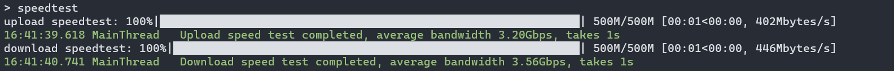

# 檔案傳輸小工具

## 簡介

`File Transfer Tool` ，是**輕量**、**快速**、**安全**、**多功能**的跨裝置檔案傳輸小工具。

### 功能

1. 文件傳輸

- 可傳輸單一檔案或整個資料夾，支援斷點續傳
- 安全性保障：為每次會話產生專屬的TLS/SSL安全證書，並最大限度地保障安全
- 進度條顯示：即時顯示檔案傳輸進度、目前網路速率、剩餘傳輸時長等訊息
- 對小檔案 (<1MB) 的傳輸進行了特別優化

2. 提供簡易的類似ssh的功能，可在遠端執行命令並即時返回結果
3. 自動尋找服務主機，也可手動指定連接主機
4. 資料夾比較，可顯示兩個資料夾中的檔案的相同、差異等訊息
5. 查看雙方系統狀態、訊息
6. 即時輸出日誌到控制台和文件中，並且可以自動整理壓縮日誌文件
7. 測試雙方之間的網路頻寬
8. 可以兩端傳送訊息，實現簡單的聊天功能
9. 同步兩端的剪切板內容
10. 可以為伺服器設定連線密碼，增強安全性

### 特點

1. 啟動、運轉、反應速度快
2. 採用最小預設配置原則，即開即用，也可以方便地自行修改配置
2. 可在區域網路、公網等任一網路環境使用，只要兩台主機可以進行網路連線即可
3. 可以指定執行緒數，採用多執行緒傳輸
4. 對於接收保留檔案、資料夾的修改時間、存取時間等訊息
5. 即用即開，即關即走，關閉程式後不會殘留進程
6. 目前適配Windows和Linux平台

### 如何選擇

1. 如果你想要功能更強大的檔案傳輸服務，請選擇FTP伺服器、客戶端（如`FileZilla`、`WinSCP`等）
2. 如果你想要穩定的檔案同步與分享，推薦使用`Resilio Sync`、`Syncthing`等
3. 如果你只是偶爾傳輸檔案/不喜歡上述服務的後台存留、資源佔用/不需要那麼強大的服務/想要自己定制功能那請選擇`File Transfer Tools`

## 安裝與運行

### 方法一：下載可執行程式

1. 點選右側`Release`
2. 下載壓縮包
3. 解壓縮資料夾，雙擊`FTT.exe`即可以預設配置運行
4. 或在終端機中執行程式以使用程式參數，例如`.\FTT.exe [-h] [-t thread] [-host host] [-d destination] [-p password] `

### 方法二：使用Python解釋器運行

1. 將原始碼複製到你的專案位置
2. 使用`pip install -r requirements.txt`安裝所有依賴項
3. 使用你的python解釋器執行腳本

## 用法

FTT 可同時為兩方提供服務，雙方都可以互相傳輸文件，執行指令。

### 建立連線時需要注意的事項
1. 若未設定密碼，FTT 開啟後預設自動尋找主機並連接，建議僅在簡單區域網路環境下使用該方式。
2. 若在複雜網路環境下或需要連接公網，一方需設定密碼，另一方指定主機名稱或ip位址及密碼進行連線。

#### 參數說明

```
usage: FTT.py [-h] [-t thread] [-host host] [-p password] [-d base_dir]

File Transfer Tool, used to transfer files and execute commands.

options:
   -h, --help show this help message and exit
   -t thread Threads (default: cpu count)
   -host host Destination hostname or ip address
   -p password, --password password
                         Set a password for the host or Use a password to connect host.
   -d base_dir, --dest base_dir
                         File save location (default: ~\Desktop)
```

`-t`: 指定執行緒數，預設為處理器數量。

`-p`: 明確設定主機密碼或指定連線密碼（預設沒有密碼），不使用此選項時，自動尋找**同一子網路**下的伺服器。
    
`-host`: 指定對方的主機名稱(可使用hostname或ip)及連接埠號碼(可選)，需搭配`-p`使用。

`-d`: 明確指定檔案接收位置，Windows平台預設為**桌面**。


#### 指令說明

連線成功後，輸入指令

1. 輸入檔案（夾）路徑，則會傳送檔案（夾）
2. 輸入`sysinfo`，則會顯示雙方的系統訊息
3. 輸入`speedtest n`，則會測試網速，其中n為本次測試的資料量，單位MB。 注意，在**電腦網路**中，1 GB = 1000 MB = 1000000 KB.
4. 輸入`compare local_dir dest_dir`來比較本機資料夾和伺服器資料夾中檔案的差異。
5. 輸入`say`給對方發送訊息，可以作為簡單聊天伺服器使用
6. 輸入`setbase`來改變檔案接收位置
7. 輸入`get clipboard` 或 `send clipboard`來同步客戶端和伺服器的剪切板內容
8. 輸入其他內容時作為指令讓伺服器執行，並且即時回傳結果。

#### 運行截圖

以下均為在同一台主機上執行的截圖。

程式啟動


傳輸檔案


執行指令：sysinfo


執行指令：speedtest



執行命令：compare


執行命令：clip


執行命令：say


執行指令：setbase


執行命令列命令


## 配置

配置項在設定檔`config`中，當設定檔不存在時，程式會使用預設配置

### Main 程式的主要配置

`windows_default_path`: Windows平台下預設的檔案接收位置

`linux_default_path`: Linux平台下預設的檔案接收位置

### Log 日誌相關配置

`windows_log_dir`: Windows平台下預設的日誌檔案存放位置

`linux_log_dir`: Linux平台下預設的日誌檔案存放位置

`log_file_archive_count`: 當日誌檔案數超過該大小時歸檔

`log_file_archive_size`: 當日誌檔案的總大小(位元組)超過該大小時歸檔

### Port 設定連接埠相關內容

`server_port`：伺服器 TCP 偵聽連接埠

`signal_port`：UDP 偵聽連接埠